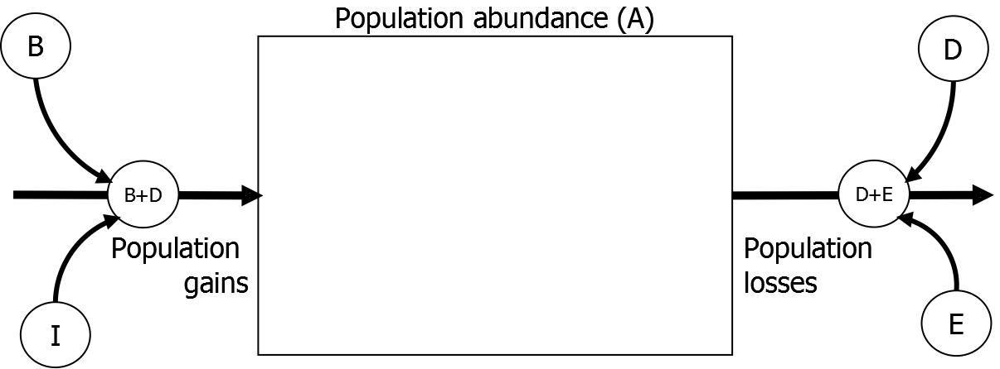

<!--
library(knitr)
rmarkdown::render_site("Lab-01.Rmd")# build website
-->

```{r opts, echo = FALSE}
knitr::opts_chunk$set(fig.path = "./images/")
```

NAME:

## LAB OVERVIEW
This laboratory consists of 4 exercises. Questions and problem sets are 
located at the end of each laboratory section. Note the numbering of the 
questions reflecting the laboratory exercise and the question number 
(e.g., 1.2, 1.2). Use this numbering when answering the questions and 
turning in laboratory. Responses to questions will be due by 5pm 
September 6th. Responses are to be entered at 
https://goo.gl/forms/7fCnlGxMnSy4VXed2. This lab is worth 25 points. 

## LABORATORY EXERCISE 1: PUBLIC TRUST RESOURCE AND TRAGEDY OF THE COMMONS 

This exercise will require 4 class volunteers to 'fish' the population. 
We will fill in the table below as a class. Note the recruitment rate is 
1 for gold and 3 for silver 

<table style="border-collapse:collapse;border-spacing:0"><tr><th style="font-family:Arial, sans-serif;font-size:14px;font-weight:normal;padding:10px 5px;border-style:solid;border-width:1px;overflow:hidden;word-break:normal;background-color:#000000;vertical-align:top"></th><th style="font-family:Arial, sans-serif;font-size:14px;font-weight:normal;padding:10px 5px;border-style:solid;border-width:1px;overflow:hidden;word-break:normal;vertical-align:top">Gold ($300)</th><th style="font-family:Arial, sans-serif;font-size:14px;font-weight:normal;padding:10px 5px;border-style:solid;border-width:1px;overflow:hidden;word-break:normal;vertical-align:top">Silver ($100)</th><th style="font-family:Arial, sans-serif;font-size:14px;font-weight:normal;padding:10px 5px;border-style:solid;border-width:1px;overflow:hidden;word-break:normal;vertical-align:top">Profit</th></tr><tr><td style="font-family:Arial, sans-serif;font-size:14px;padding:10px 5px;border-style:solid;border-width:1px;overflow:hidden;word-break:normal;font-style:italic;text-align:center;vertical-align:top" colspan="4">Round 1 (30 Seconds)</td></tr><tr><td style="font-family:Arial, sans-serif;font-size:14px;padding:10px 5px;border-style:solid;border-width:1px;overflow:hidden;word-break:normal;vertical-align:top">1.</td><td style="font-family:Arial, sans-serif;font-size:14px;padding:10px 5px;border-style:solid;border-width:1px;overflow:hidden;word-break:normal;vertical-align:top"></td><td style="font-family:Arial, sans-serif;font-size:14px;padding:10px 5px;border-style:solid;border-width:1px;overflow:hidden;word-break:normal;vertical-align:top"></td><td style="font-family:Arial, sans-serif;font-size:14px;padding:10px 5px;border-style:solid;border-width:1px;overflow:hidden;word-break:normal;vertical-align:top"></td></tr><tr><td style="font-family:Arial, sans-serif;font-size:14px;padding:10px 5px;border-style:solid;border-width:1px;overflow:hidden;word-break:normal;vertical-align:top">2.</td><td style="font-family:Arial, sans-serif;font-size:14px;padding:10px 5px;border-style:solid;border-width:1px;overflow:hidden;word-break:normal;vertical-align:top"></td><td style="font-family:Arial, sans-serif;font-size:14px;padding:10px 5px;border-style:solid;border-width:1px;overflow:hidden;word-break:normal;vertical-align:top"></td><td style="font-family:Arial, sans-serif;font-size:14px;padding:10px 5px;border-style:solid;border-width:1px;overflow:hidden;word-break:normal;vertical-align:top"></td></tr><tr><td style="font-family:Arial, sans-serif;font-size:14px;padding:10px 5px;border-style:solid;border-width:1px;overflow:hidden;word-break:normal;vertical-align:top">3.</td><td style="font-family:Arial, sans-serif;font-size:14px;padding:10px 5px;border-style:solid;border-width:1px;overflow:hidden;word-break:normal;vertical-align:top"></td><td style="font-family:Arial, sans-serif;font-size:14px;padding:10px 5px;border-style:solid;border-width:1px;overflow:hidden;word-break:normal;vertical-align:top"></td><td style="font-family:Arial, sans-serif;font-size:14px;padding:10px 5px;border-style:solid;border-width:1px;overflow:hidden;word-break:normal;vertical-align:top"></td></tr><tr><td style="font-family:Arial, sans-serif;font-size:14px;padding:10px 5px;border-style:solid;border-width:1px;overflow:hidden;word-break:normal;vertical-align:top">4.</td><td style="font-family:Arial, sans-serif;font-size:14px;padding:10px 5px;border-style:solid;border-width:1px;overflow:hidden;word-break:normal;vertical-align:top"></td><td style="font-family:Arial, sans-serif;font-size:14px;padding:10px 5px;border-style:solid;border-width:1px;overflow:hidden;word-break:normal;vertical-align:top"></td><td style="font-family:Arial, sans-serif;font-size:14px;padding:10px 5px;border-style:solid;border-width:1px;overflow:hidden;word-break:normal;vertical-align:top"></td></tr><tr><td style="font-family:Arial, sans-serif;font-size:14px;padding:10px 5px;border-style:solid;border-width:1px;overflow:hidden;word-break:normal;background-color:#000000;vertical-align:top"></td><td style="font-family:Arial, sans-serif;font-size:14px;padding:10px 5px;border-style:solid;border-width:1px;overflow:hidden;word-break:normal;vertical-align:top">Gold ($300)</td><td style="font-family:Arial, sans-serif;font-size:14px;padding:10px 5px;border-style:solid;border-width:1px;overflow:hidden;word-break:normal;vertical-align:top">Silver ($100)</td><td style="font-family:Arial, sans-serif;font-size:14px;padding:10px 5px;border-style:solid;border-width:1px;overflow:hidden;word-break:normal;vertical-align:top">Profit</td></tr><tr><td style="font-family:Arial, sans-serif;font-size:14px;padding:10px 5px;border-style:solid;border-width:1px;overflow:hidden;word-break:normal;font-style:italic;text-align:center;vertical-align:top" colspan="4">Round 2 (30 Seconds)</td></tr><tr><td style="font-family:Arial, sans-serif;font-size:14px;padding:10px 5px;border-style:solid;border-width:1px;overflow:hidden;word-break:normal;vertical-align:top">1.</td><td style="font-family:Arial, sans-serif;font-size:14px;padding:10px 5px;border-style:solid;border-width:1px;overflow:hidden;word-break:normal;vertical-align:top"></td><td style="font-family:Arial, sans-serif;font-size:14px;padding:10px 5px;border-style:solid;border-width:1px;overflow:hidden;word-break:normal;vertical-align:top"></td><td style="font-family:Arial, sans-serif;font-size:14px;padding:10px 5px;border-style:solid;border-width:1px;overflow:hidden;word-break:normal;vertical-align:top"></td></tr><tr><td style="font-family:Arial, sans-serif;font-size:14px;padding:10px 5px;border-style:solid;border-width:1px;overflow:hidden;word-break:normal;vertical-align:top">2.</td><td style="font-family:Arial, sans-serif;font-size:14px;padding:10px 5px;border-style:solid;border-width:1px;overflow:hidden;word-break:normal;vertical-align:top"></td><td style="font-family:Arial, sans-serif;font-size:14px;padding:10px 5px;border-style:solid;border-width:1px;overflow:hidden;word-break:normal;vertical-align:top"></td><td style="font-family:Arial, sans-serif;font-size:14px;padding:10px 5px;border-style:solid;border-width:1px;overflow:hidden;word-break:normal;vertical-align:top"></td></tr><tr><td style="font-family:Arial, sans-serif;font-size:14px;padding:10px 5px;border-style:solid;border-width:1px;overflow:hidden;word-break:normal;vertical-align:top">3.</td><td style="font-family:Arial, sans-serif;font-size:14px;padding:10px 5px;border-style:solid;border-width:1px;overflow:hidden;word-break:normal;vertical-align:top"></td><td style="font-family:Arial, sans-serif;font-size:14px;padding:10px 5px;border-style:solid;border-width:1px;overflow:hidden;word-break:normal;vertical-align:top"></td><td style="font-family:Arial, sans-serif;font-size:14px;padding:10px 5px;border-style:solid;border-width:1px;overflow:hidden;word-break:normal;vertical-align:top"></td></tr><tr><td style="font-family:Arial, sans-serif;font-size:14px;padding:10px 5px;border-style:solid;border-width:1px;overflow:hidden;word-break:normal;vertical-align:top">4.</td><td style="font-family:Arial, sans-serif;font-size:14px;padding:10px 5px;border-style:solid;border-width:1px;overflow:hidden;word-break:normal;vertical-align:top"></td><td style="font-family:Arial, sans-serif;font-size:14px;padding:10px 5px;border-style:solid;border-width:1px;overflow:hidden;word-break:normal;vertical-align:top"></td><td style="font-family:Arial, sans-serif;font-size:14px;padding:10px 5px;border-style:solid;border-width:1px;overflow:hidden;word-break:normal;vertical-align:top"></td></tr></table>

### Questions (2 points)

1.1. Did any of the fish species go extinct? If so which ones? (1 Point) 
<br>
<br>
<br>
<br>
<br>
1.2. How could you have managed the catch to prevent the fish from 
becoming extinct? (1 Point; Note: There is no right or wrong answer, 
just propose and idea and defend why it may work) 
<br>
<br>
<br>
<br>
<br>


## LABORATORY EXERCISE 2: POPULATION DYNAMICS IN LAKE BULLDOG 

Lake Bulldog is a 10 acre lentic system located in Mississippi. The 
population dynamics of Largemouth Bass _Micropterus salmoides_ in the 
system is characterized by the number of births and immigrants, less the 
number of deaths and emigrants, a model known as the BIDE model. This 
model formally calculates the change in a population over time as: 


$$\frac{dA}{dt}=B+I-(D+E)$$ 


This equation is not too scary, it simply states:


$$\frac{The\,change\,in\,abundance}{The\,change\,in\,time}=Births+Immigra 
nts-(Deaths+Emmigrants)$$


and conceptually it looks like this:


```{r echo=FALSE, out.width="95%"}

```


Figure 1.—Conceptual representation of the BIDE model. The population 
gains represents additions to the population and the population losses 
are flows out of the population. The arrows pointing into and out of the 
box are called 'flows'. This is what is commonly referred to as a stock 
and flow or a box and flow diagram. 

In most applications the change in time is 1 year (i.e., dt = 1), which 
makes it easy to forecast population dynamics over time. Let’s expand 
the equation above to do this (notice that is equal to 1) 


$$\frac{dA}{dt}=B+I-(D+E)$$


$$\frac{{{A}_{t+dt}}-{{A}_{t}}}{dt}=B+I-(D+E)$$


$$\frac{{{A}_{t+1}}-{{A}_{t}}}{1}=B+I-(D+E)$$


$${{A}_{t+1}}-{{A}_{t}}=B+I-(D+E)$$


$${{A}_{t+1}}={{A}_{t}}+B+I-(D+E)$$


$${{A}_{t+1}}={{A}_{t}}+\frac{dA}{dt}$$


OK I have hopefully proved my point, let’s move on to the fun stuff. 
Suppose, the birth, immigration, death, and emigration rates for Lake 
Bulldog are: 


* Birth (fish per year;$B$)=4 
* Immigration (fish per year;$I$)=0 
* Death (fish per year; $D$)=3 
* Emigration (fish per year; $E$)=0 


Using the figure for Lake Bulldog (laminated sheet 1):

1.Add 5 goldfish to the outline of Lake Bulldog. This represents the 
initial population abundance in 2015, see Table 1.  
2.Add 4 Goldfish representing births and remove 3 goldfish representing 
deaths from the lake and count how many gold fish remain in the Lake 
Bulldog. The difference of births and deaths is $\frac{dA}{dt}$ 
(Equation 3). Record this number for $\frac{dA}{dt}$ in year 2015.   
3.Record this number as the abundances ($A$) in year 2016. This should 
equal equation 8 if you simply add them up in Table 1.   
4.Add 4 Goldfish representing births and remove 3 goldfish representing 
deaths from the lake and. The difference of births and deaths is 
$\frac{dA}{dt}$. Record this number for $\frac{dA}{dt}$ in year 2016.   
5.Count how many gold fish remain in the Lake Bulldog Record this number 
as the abundances (A) in year 2017.   
6. Repeat steps 4 and 5 until Table 1 is filled.  

Table 1. Forecasted population dynamics of Largemouth Bass in Lake 
Bulldog. 


```{r,echo=FALSE}
yr<-2017
tmp<-data.frame(year1=c(yr:(yr+4)),
    dadt1=rep("__________",5),
    A1=rep("__________",5),
    year2=c((yr+5):(yr+9)),
    dadt2=rep("__________",5),
    A2=rep("__________",5))

knitr::kable(tmp,col.names=c("Year (t)","$\\frac{dA}{dt}$",
    "$A$","Year (t)","$\\frac{dA}{dt}$",
    "$A$"),align=c("rccrcc"))
    
```


7. Using the data in Table 1 plot the population abundance (A; y-axis) 
versus Year (t; x-axis). 

```{r,echo=FALSE,fig.width=3,fig.height=5,fig.align="center"}
xmin <- 2015
xmax <- 2025
ymin <- 0
ymax <- 10

plot(c(xmin,xmax),c(ymin,ymax),type='n',las=1,#asp=1,
	ylab="Abundance",xlab="Year", cex.lab=1.3)
abline(h=seq(ymin,ymax,by=1),col='lightgrey')
#abline(h=seq(ymin,ymax,by=5),col='black')
abline(v=seq(xmin,xmax,by=1),col='lightgrey')
#abline(v=seq(xmin,xmax,,by=10),col='black')
```


8. Using the data in Table 1 plot the change in abundance over time ("$\frac{dA}{dt}$; 
y-axis) versus abundance (A; x-axis). 

```{r,echo=FALSE,fig.width=6.5,fig.height=6.5}
xmin <- 0
xmax <- 20
ymin <- 0
ymax <- 10
par(oma=c(6,0,0,0))
plot(c(xmin,xmax),c(ymin,ymax),type='n',las=1,#asp=1,
	ylab="dA/dt",xlab="Abundance", cex.lab=1.3)
abline(h=seq(ymin,ymax,by=1),col='lightgrey')
#abline(h=seq(ymin,ymax,by=5),col='black')
abline(v=seq(xmin,xmax,by=1),col='lightgrey')
#abline(v=seq(xmin,xmax,,by=10),col='black')
```


### Questions (9 points)
2.1. Given the parameters used to calculate   and A report the following values (3 points): 
    A) What will  be in year 2028?  
    B) What will A be in year 2027? 
    C) Suppose the birth rate was 3 and the death rate was 4 
    (immigration and emigration are 0) and the initial population was 8 in 2015.
    How many fish will there be in 2018?
<br>
<br>
<br>
<br>
<br>
2.2. The model of population dynamics in Lake Bulldog assumes 3 fish/year are added per year.  Does this seem biologically realistic to you?  Why or why not? (3 points)
<br>
<br>
<br>
<br>
<br>
2.3. What does setting Immigration and Emigration to 0 assume? (3 points)
<br>
<br>
<br>
<br>
<br>

## LABORATORY EXERCISE 3: POPULATION DYNAMICS IN BULLDOG CREEK


Bulldog Creek is a first order tributary (i.e., headwater 
stream)^[https://en.wikipedia.org/wiki/Strahler_number] to Lake Bulldog 
and is occupied by Largemouth Bass. There is a 5 m scenic waterfall 
located at river kilometer (RKM) 0.5. The birth rate is similar to Lake 
Bulldog but the death and emigration rates differ. 


$$\begin{align}
  & \text{Birth:}\,B=3 \\ 
 & \text{Immigration:}\,I=0 \\ 
 & \text{Death:}\,D=2 \\ 
 & \text{Emigration:}\,E=1 \\ 
\end{align}$$


Using the figure for Bulldog Creek (laminated sheet 2):

1. Add 10 goldfish to the outline of Bulldog Creek. This represents the 
initial population abundance in 2015, see Table 1. 
2. Add 3 Goldfish representing births and remove 2 goldfish representing 
deaths and 1 goldfish representing emigration from the system. Births 
less deaths and emigration is (Equation 3). Record this number for in 
year 2015 in Table 2. 
3. Count how many gold fish remain in the Bulldog Creek and record this 
number as the abundance (A) in year 2016 in Table 2. This should equal 
equation 8 if you simply add them up in Table 2. 
4. Repeat steps 2 and 3 for the remaining years until Table 2 is filled. 


Table 2. Forecasted population dynamics of Largemouth Bass in Bulldog Creek.  

<table style="border-collapse:collapse;border-spacing:0"><tr><th style="font-family:Arial, sans-serif;font-size:14px;font-weight:normal;padding:10px 5px;border-style:solid;border-width:1px;overflow:hidden;word-break:normal;vertical-align:top">Year (t)</th><th style="font-family:Arial, sans-serif;font-size:14px;font-weight:normal;padding:10px 5px;border-style:solid;border-width:1px;overflow:hidden;word-break:normal;vertical-align:top">$dA/dt*$</th><th style="font-family:Arial, sans-serif;font-size:14px;font-weight:normal;padding:10px 5px;border-style:solid;border-width:1px;overflow:hidden;word-break:normal;vertical-align:top">A</th></tr><tr><td style="font-family:Arial, sans-serif;font-size:14px;padding:10px 5px;border-style:solid;border-width:1px;overflow:hidden;word-break:normal;vertical-align:top">2015</td><td style="font-family:Arial, sans-serif;font-size:14px;padding:10px 5px;border-style:solid;border-width:1px;overflow:hidden;word-break:normal;vertical-align:top"></td><td style="font-family:Arial, sans-serif;font-size:14px;padding:10px 5px;border-style:solid;border-width:1px;overflow:hidden;word-break:normal;vertical-align:top">10</td></tr><tr><td style="font-family:Arial, sans-serif;font-size:14px;padding:10px 5px;border-style:solid;border-width:1px;overflow:hidden;word-break:normal;vertical-align:top">2016</td><td style="font-family:Arial, sans-serif;font-size:14px;padding:10px 5px;border-style:solid;border-width:1px;overflow:hidden;word-break:normal;vertical-align:top"></td><td style="font-family:Arial, sans-serif;font-size:14px;padding:10px 5px;border-style:solid;border-width:1px;overflow:hidden;word-break:normal;vertical-align:top"></td></tr><tr><td style="font-family:Arial, sans-serif;font-size:14px;padding:10px 5px;border-style:solid;border-width:1px;overflow:hidden;word-break:normal;vertical-align:top">2017</td><td style="font-family:Arial, sans-serif;font-size:14px;padding:10px 5px;border-style:solid;border-width:1px;overflow:hidden;word-break:normal;vertical-align:top"></td><td style="font-family:Arial, sans-serif;font-size:14px;padding:10px 5px;border-style:solid;border-width:1px;overflow:hidden;word-break:normal;vertical-align:top"></td></tr><tr><td style="font-family:Arial, sans-serif;font-size:14px;padding:10px 5px;border-style:solid;border-width:1px;overflow:hidden;word-break:normal;vertical-align:top">2018</td><td style="font-family:Arial, sans-serif;font-size:14px;padding:10px 5px;border-style:solid;border-width:1px;overflow:hidden;word-break:normal;vertical-align:top"></td><td style="font-family:Arial, sans-serif;font-size:14px;padding:10px 5px;border-style:solid;border-width:1px;overflow:hidden;word-break:normal;vertical-align:top"></td></tr><tr><td style="font-family:Arial, sans-serif;font-size:14px;padding:10px 5px;border-style:solid;border-width:1px;overflow:hidden;word-break:normal;vertical-align:top">2019</td><td style="font-family:Arial, sans-serif;font-size:14px;padding:10px 5px;border-style:solid;border-width:1px;overflow:hidden;word-break:normal;vertical-align:top"></td><td style="font-family:Arial, sans-serif;font-size:14px;padding:10px 5px;border-style:solid;border-width:1px;overflow:hidden;word-break:normal;vertical-align:top"></td></tr><tr><td style="font-family:Arial, sans-serif;font-size:14px;padding:10px 5px;border-style:solid;border-width:1px;overflow:hidden;word-break:normal;vertical-align:top">2020</td><td style="font-family:Arial, sans-serif;font-size:14px;padding:10px 5px;border-style:solid;border-width:1px;overflow:hidden;word-break:normal;vertical-align:top"></td><td style="font-family:Arial, sans-serif;font-size:14px;padding:10px 5px;border-style:solid;border-width:1px;overflow:hidden;word-break:normal;vertical-align:top"></td></tr><tr><td style="font-family:Arial, sans-serif;font-size:14px;padding:10px 5px;border-style:solid;border-width:1px;overflow:hidden;word-break:normal;vertical-align:top">2021</td><td style="font-family:Arial, sans-serif;font-size:14px;padding:10px 5px;border-style:solid;border-width:1px;overflow:hidden;word-break:normal;vertical-align:top"></td><td style="font-family:Arial, sans-serif;font-size:14px;padding:10px 5px;border-style:solid;border-width:1px;overflow:hidden;word-break:normal;vertical-align:top"></td></tr><tr><td style="font-family:Arial, sans-serif;font-size:14px;padding:10px 5px;border-style:solid;border-width:1px;overflow:hidden;word-break:normal;vertical-align:top">2022</td><td style="font-family:Arial, sans-serif;font-size:14px;padding:10px 5px;border-style:solid;border-width:1px;overflow:hidden;word-break:normal;vertical-align:top"></td><td style="font-family:Arial, sans-serif;font-size:14px;padding:10px 5px;border-style:solid;border-width:1px;overflow:hidden;word-break:normal;vertical-align:top"></td></tr><tr><td style="font-family:Arial, sans-serif;font-size:14px;padding:10px 5px;border-style:solid;border-width:1px;overflow:hidden;word-break:normal;vertical-align:top">2023</td><td style="font-family:Arial, sans-serif;font-size:14px;padding:10px 5px;border-style:solid;border-width:1px;overflow:hidden;word-break:normal;vertical-align:top"></td><td style="font-family:Arial, sans-serif;font-size:14px;padding:10px 5px;border-style:solid;border-width:1px;overflow:hidden;word-break:normal;vertical-align:top"></td></tr><tr><td style="font-family:Arial, sans-serif;font-size:14px;padding:10px 5px;border-style:solid;border-width:1px;overflow:hidden;word-break:normal;vertical-align:top">2024</td><td style="font-family:Arial, sans-serif;font-size:14px;padding:10px 5px;border-style:solid;border-width:1px;overflow:hidden;word-break:normal;vertical-align:top"></td><td style="font-family:Arial, sans-serif;font-size:14px;padding:10px 5px;border-style:solid;border-width:1px;overflow:hidden;word-break:normal;vertical-align:top"></td></tr><tr><td style="font-family:Arial, sans-serif;font-size:14px;padding:10px 5px;border-style:solid;border-width:1px;overflow:hidden;word-break:normal;vertical-align:top">2025</td><td style="font-family:Arial, sans-serif;font-size:14px;padding:10px 5px;border-style:solid;border-width:1px;overflow:hidden;word-break:normal;vertical-align:top"></td><td style="font-family:Arial, sans-serif;font-size:14px;padding:10px 5px;border-style:solid;border-width:1px;overflow:hidden;word-break:normal;vertical-align:top"></td></tr></table>

```{r,echo=FALSE}
yr<-2017
tmp<-data.frame(year1=c(yr:(yr+4)),
    dadt1=rep("__________",5),
    A1=rep("__________",5),
    year2=c((yr+5):(yr+9)),
    dadt2=rep("__________",5),
    A2=rep("__________",5))
tmp[1,3]<-10
knitr::kable(tmp,col.names=c("Year (t)","$\\frac{dA}{dt}$",
    "$A$","Year (t)","$\\frac{dA}{dt}$",
    "$A$"),align=c("rccrcc"))
    
```


* Because we are working on an annual time step dt = 1.

5. Using the data in Table 2 plot the population abundance ($A$; y-axis) 
versus Year (t; x-axis). 


```{r,echo=FALSE}
xmin <- 2015
xmax <- 2025
ymin <- 0
ymax <- 20
#par(oma=c(0,7.5,0,8))
plot(c(xmin,xmax),c(ymin,ymax),type='n',las=1,asp=1,
	ylab="Abundance",xlab="Year", cex.lab=1.3,xlim=c(2015,2025),xaxt='n')
axis(1, at=c(2015:2025),labels=FALSE)
axis(1, at=seq(2015,2025,5),labels=TRUE)

abline(h=seq(ymin,ymax,by=1),col='lightgrey')
#abline(h=seq(ymin,ymax,by=5),col='black')
abline(v=seq(xmin,xmax,by=1),col='lightgrey')
#abline(v=seq(xmin,xmax,,by=10),col='black')
```


6. Using the data in Table 2 plot the change in abundance over time ( ; 
y-axis) versus abundance (A; x-axis). 


```{r,echo=FALSE,fig.align="center"}
xmin <- 0
xmax <- 20
ymin <- 0
ymax <- 10
#par(oma=c(6,0,6,0))
plot(c(xmin,xmax),c(ymin,ymax),type='n',las=1,asp=1,
	ylab="dA/dt",xlab="Abundance", cex.lab=1.3)
abline(h=seq(ymin,ymax,by=1),col='lightgrey')
#abline(h=seq(ymin,ymax,by=5),col='black')
abline(v=seq(xmin,xmax,by=1),col='lightgrey')
#abline(v=seq(xmin,xmax,,by=10),col='black')
```

### Questions (9 points)
3.1. The BIDE model allows for emigration from the system, but the 
immigration rate is 0. Is this biologically reasonable to you given this 
system? Why or why not? (3 points) 
<br>
<br>
<br>
<br>
<br>
3.2. In the Bulldog Creek example, what was the difference between 
births and deaths? Was the number positive, negative, or 0? Based on 
whether the number is positive, negative or 0, what should the 
population do if the initial abundance was 20 (hint: look at Figure 2). 
(3 points) 
<br>
<br>
<br>
<br>
<br>
3.3. How does the plot of abundance for Bulldog Creek compare to the 
same plot for Lake Bulldog? How does the difference between births and 
deaths for Lake Bulldog compare to Bulldog Creek? (3 points) 
<br>
<br>
<br>
<br>
<br>


## LABORATORY EXERCISE 4: EXONENTIAL POPULATION DYNAMICS 

### Exponential model

The exponential model adds biological realism to the generic BIDE model. 
This is done by making population growth dependent on population 
abundance. Follow the exercise below for a better understanding of 
exponential population dynamics. 

1. Put 5 goldfish on the rectangle representing the stock (Exponential 
dynamics, laminated sheet 4). 
2. Multiply the number of goldfish in the box by the intrinsic growth 
rate ($r$) which is 0.25 for this demonstration (i.e., ) to calculate the 
population gains for 2015. Record this number for year 2015 in Table 3. 
3. Round that number to the nearest whole number and add that many 
goldfish to the stock box (i.e., ). Count how many goldfish there are in 
the box and Record this number for A in 2016 in Table 3. 
4. Repeat steps 2 and 3 until Table 3 is completed.

  
Table 3. Forecasted population dynamics of Largemouth Bass in Lake Bulldog.  


| Year (t) 	| Population gains 	| $dA/dt$ 	| A 	|
|----------	|------------------	|---------	|---	|
| 2015     	|                  	|         	| 5 	|
| 2016     	|                  	|         	|   	|
| 2017     	|                  	|         	|   	|
| 2018     	|                  	|         	|   	|
| 2019     	|                  	|         	|   	|
| 2020     	|                  	|         	|   	|
| 2021     	|                  	|         	|   	|
| 2022     	|                  	|         	|   	|
| 2023     	|                  	|         	|   	|
| 2024     	|                  	|         	|   	|
| 2025     	|                  	|         	|   	|


5. Using the data in Table 2 plot the population abundance ($A$; y-axis) 
versus Year ($t$; x-axis). 


```{r,echo=FALSE}
#par(oma=c(6,10,2,15))
plot(c(2015,2025),c(0,60),type='n',las=1,asp=1,
	ylab="Abundance",xlab="Year", cex.lab=1.3,xaxt='n')
axis(1, at=c(2015:2025))
	abline(h=seq(0,60,by=1),col='lightgrey')
	abline(v=seq(2015,2025,by=1),col='lightgrey')
```

6. Using the data in Table 3 plot the change in abundance over time ($dA/dt$; 
y-axis) versus abundance ($A$; x-axis). 

```{r,echo=FALSE}
#par(oma=c(12,3,6,3))
plot(c(0,60),c(0,20),type='n',las=1,asp=1,
	ylab="dA/dt",xlab="Abundance", cex.lab=1.3)
	abline(h=seq(0,20,by=1),col='lightgrey')
	abline(v=seq(0,60,by=1),col='lightgrey')
```


### Exponential model with harvest

Now that we have an increased understanding in population dynamics, we 
can add harvest to the population, this will be key for harvesting fish, 
or any other critter for that matter. Let’s build on the previous 
exponential population by adding harvest to the equation. This can be 
formally expressed as: 


$$\frac{dA}{dt}=r\cdot A-F\cdot A$$


Like before let’s reinforce this with our goldfish on a stock and flow 
diagram. 


1. Put 5 goldfish on the rectangle representing the stock (Exponential 
dynamics, laminated sheet 4). 
2. Multiply the number of goldfish in the box by the intrinsic growth 
rate ($r$ = 0.75) to get the population gains and record this number for 
2015 in Table 4, including up to 2 decimal places. 
3. Multiply the number of goldfish in the box by the fishing mortality 
rate ($F$= 0.55) to get the population losses and record this number for 
2015 in Table 4, including up to 2 decimal places. 
4. Calculate the population change over the year for 2015 as population 
gains-population losses (i.e., $\frac{dA}{dt}=r\cdot A-F\cdot A$). 
Round that number to the nearest whole number and record this number for 
year 2015 in Table 4. 
5. Add that many goldfish to the stock box. Count how many goldfish 
there are in the box and Record this number for A in 2016 in Table 3. 
6. Repeat steps 2 and 5 until Table 3 is completed. 


Table 4. Forecasted population dynamics of Largemouth Bass in Lake Bulldog. 

| Year (t) 	| Population gains 	| Population losses 	| $dA/dt$ 	| A 	|
|----------	|------------------	|-------------------	|---------	|---	|
| 2015     	|                  	|                   	|         	| 5 	|
| 2016     	|                  	|                   	|         	|   	|
| 2017     	|                  	|                   	|         	|   	|
| 2018     	|                  	|                   	|         	|   	|
| 2019     	|                  	|                   	|         	|   	|
| 2020     	|                  	|                   	|         	|   	|
| 2021     	|                  	|                   	|         	|   	|
| 2022     	|                  	|                   	|         	|   	|
| 2023     	|                  	|                   	|         	|   	|
| 2024     	|                  	|                   	|         	|   	|
| 2025     	|                  	|                   	|         	|   	|


7. Using the data in Table 4 plot abundance over time ($A$; y-axis) versus 
Year (t; x-axis). 

```{r,echo=FALSE}
plot(c(2015,2025),c(0,35),type='n',las=1,asp=0.25,
	ylab="Abundance",xlab="Year", cex.lab=1.3,xaxt='n')
	axis(1, at=c(2015:2025))
	abline(h=seq(0,35,by=1),col='lightgrey')
	abline(v=seq(2015,2025,by=1),col='lightgrey')
	abline(v=seq(2015,2025,by=1),col='lightgrey')
```


8. Using the data in Table 4 plot the change in abundance over time ($dA/dt$; 
y-axis) versus abundance ($A$; x-axis). 


```{r,echo=FALSE}
# plot dA/dt versus A
#par(oma=c(10,0,10,0))
plot(c(0,60),c(0,10),type='n',las=1,asp=1,
	ylab="dA/dt",xlab="Abundance", cex.lab=1.3)
	abline(h=seq(0,10,by=1),col='lightgrey')
	abline(v=seq(0,60,by=1),col='lightgrey')

```

### Questions (5 points)
4.1. How does the plot of versus A for both exponential models differ 
for the BIDE models? (2 points) 
<br>
<br>
<br>
<br>
<br>
4.2. Given the population dynamics and rates for the exponential model 
with harvest, what would you set harvest to? Why? (2 points; there is 
really no right or wrong answer here I am curious about your process) 
<br>
<br>
<br>
<br>
<br>
4.3. Can you think of any way to improve this model? (1 point) 
<br>
<br>
<br>
<br>
<br>


