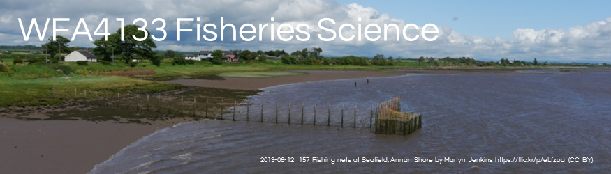

```{r echo=FALSE, out.width="95%"}

```
<!--

library(knitr)
rmarkdown::render_site("Classes.Rmd")# build website

# COPY FILES TO DOCS FOR GITHUB.IO
# rmarkdown::render_site()# build website
# system(paste("xcopy", "C:/Users/mcolvin/Documents/Teaching/WFA4133-Fisheries-Science/Course-Materials/_site"',     '"C:/Users/mcolvin/Documents/Teaching/WFA4133-Fisheries-Science/Docs"',     "/E /C /H /R /K /O /Y"));q(save="no")  

-->

## Classes
1. History of fisheries management 
1. Fisheries management overview
    1. Public trust resource
    2. North American conservation model
    3. Fishery types
2. Governance and management process
    1. State
        1. Inland freshwater 
        2. Marine (shellfish, resident fish)
    2. Multistate (mobile interjurisdictional fisheries) 
        1. Inland freshwater
        2. Marine
    3. Diadromous
        1. State
        2. interjurisdictional
    4. Tribal
3. Fisheries and management types
4. Population dynamics
5. Management objectives
    1. HW-creating objectives
